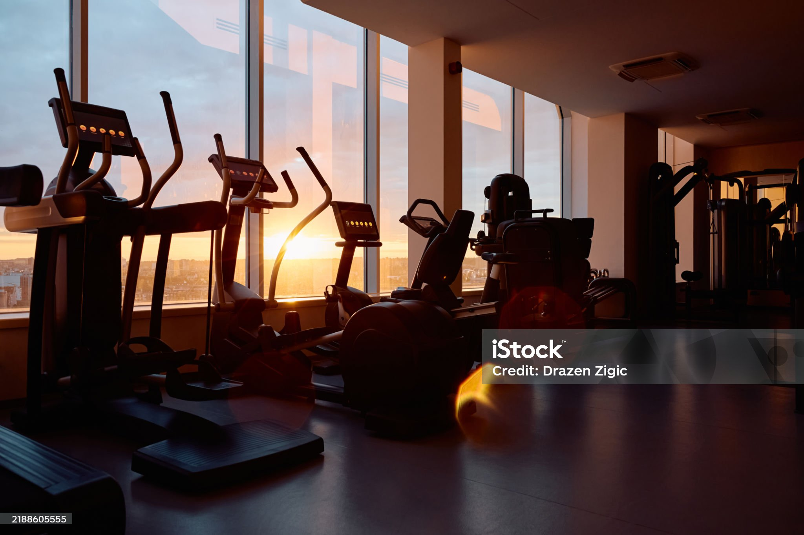

# 🏋️ FitLab - Landing Page de Alta Conversión

**[IR AL SITIO EN VIVO 🚀](https://gonzaloorlandoni.github.io/demo-fitlab-landing-page/)**

---

## 🎯 OBJETIVO Y ESTRATEGIA (Case Study)

Este proyecto fue desarrollado para el portfolio de **GO Web Solutions**. Nuestro objetivo fue demostrar cómo el **diseño estratégico** y la **arquitectura de código** se unen para maximizar la conversión en el sector fitness.

| Aspecto           | Desafío Resuelto                                                                                                      |
| :---------------- | :-------------------------------------------------------------------------------------------------------------------- |
| **Conversión**    | Guiar al usuario directamente a la sección de planes y contacto con un **CTA claro** y un diseño de flujo optimizado. |
| **Performance**   | Lograr un sitio rápido y ligero, crucial para la indexación **SEO** y la retención de usuarios móviles.               |
| **Escalabilidad** | Utilizar metodologías de arquitectura avanzada para un código mantenible a largo plazo.                               |

## 💻 TECNOLOGÍAS Y ARQUITECTURA

Este proyecto fue construido utilizando un stack sólido y moderno, demostrando experiencia en:

- **SASS/SCSS:** Utilizado para la estilización modular (variables, anidación, parciales), garantizando un **CSS organizado** y fácil de escalar.
- **HTML5 Semántico:** Estructura limpia y accesible, optimizada para el SEO.
- **CSS3 (Flexbox/Grid):** Para layouts complejos y un diseño **100% _responsive_** y adaptable a cualquier dispositivo.
- **JavaScript:** Para interacciones del DOM y lógica simple del formulario (si aplica).
- **Vercel / GitHub Pages:** Para despliegue (Deployment).

## ✨ PRUEBA DE VALOR (Destacados del Código)

- **Animaciones y UX:** Implementación de efectos de movimiento y _hover_ sutiles para una interacción moderna.
- **Optimización SEO:** Configuración inicial de meta-etiquetas esenciales y jerarquía de encabezados (H1 único).
- **Clean Code:** Estilos organizados para una lectura y mantenimiento eficiente por cualquier desarrollador.

---

### Desarrollado por **GO Web Solutions**
